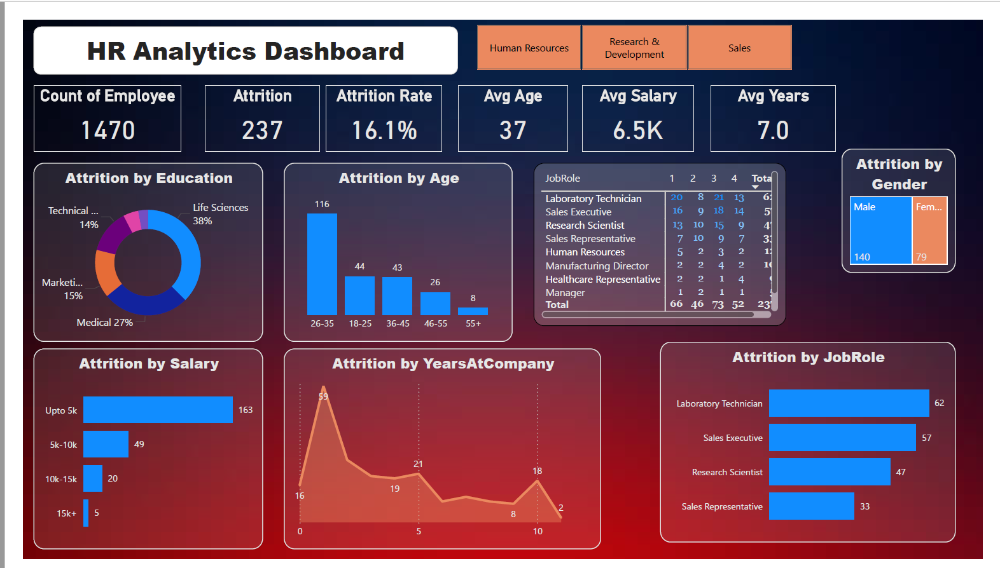
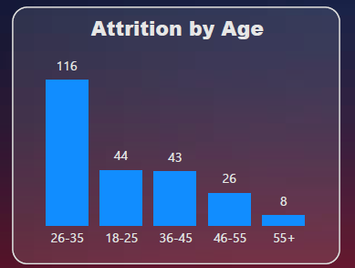
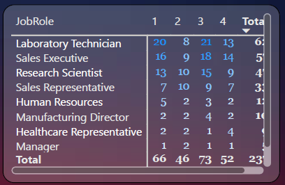
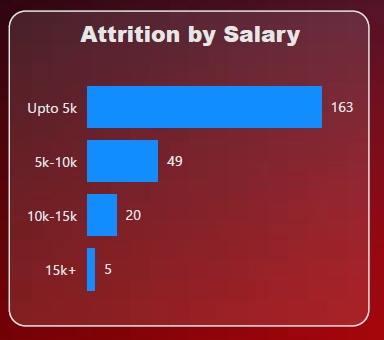
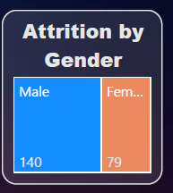
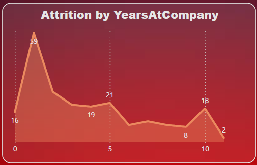

# HR Analytics Dashboard

Welcome to the HR Analytics Dashboard project! This repository showcases an interactive Power BI dashboard designed to help organizations better understand employee attrition, workforce demographics, and related HR trends.

## Problem Statement

Employee attrition is one of the biggest challenges for HR departments. Understanding **who is leaving, why, and from where** is key to improving employee retention and satisfaction.

The goal of this dashboard is to:
- Analyze attrition patterns across demographics, departments, and salary brackets
- Provide a high-level and granular view of workforce composition
- Support data-driven HR decisions for talent retention

## Demo of the dashboard:

### Level 1: 
Slicers and date filters are given using which we can filter the visuals based on

	- Department
	- Gender	

### Level 2: 
Card visuals, column charts, pie charts, and line charts are used to show detailed trends.

##### 6 card visuals shows

	-Count of Employee
	-Attrition
	-Attrition Rate
	-Average Age
	-Average Salary
	-Average Years
 
 ##### Column chart shows

 	-Attrition By Age

  ##### Pie chart shows

  	-Attrition By Education

   ##### Line chart shows

   	-Attrition by Years At company

### Level 3: 
The Table visual displays attrition rates segmented by job role and job satisfaction levels, helping to identify patterns between employee satisfaction and turnover.

## Preparation of dataset:

- The transformation and data cleaning is done in Power Query and then the data is loaded.
- Fields included: Age, Gender, Education, Job Role, Department, Monthly Income, Years at Company, and Attrition flag.

## Cleaning & Transformation:

- Removed nulls and duplicates
- Grouped salary into ranges (e.g., Upto 5K, 5K–10K, etc.)
- Mapped age into age groups (e.g., 18–25, 26–35, etc.)
- Used Power BI DAX for calculated metrics like Attrition Rate, Average Tenure, etc.

## Report Snapshot (Power BI Desktop)
 

- Snap of slicers used, through which the user can filter the report.

- Card visuals represented the Count of Employee, Attrition, Attrition Rate, Average Age, etc.

- Shows which age brackets experience the highest attrition.

- The Table visual displays attrition rates segmented by job role and job satisfaction levels, helping to identify patterns between employee satisfaction and turnover.        

 

- Helps understand if low pay correlates with higher attrition.

- Gender-wise attrition trend.

- Insights into how tenure affects attrition.

## Analysis and Result:

The HR Analytics Dashboard reveals critical insights into employee attrition patterns across job roles, age groups, education backgrounds, and salary brackets. With an overall attrition rate of 16.1%, the analysis highlights that:

	- Young professionals aged 26–35 show the highest attrition, indicating possible career transitions or job dissatisfaction at early stages.
	- Life Sciences and Medical education backgrounds have the highest number of employees leaving, possibly reflecting industry trends or role mismatches.
	- Low salary bands (Upto ₹5K) have significantly higher attrition, confirming a strong correlation between compensation and turnover.
	- Roles such as Laboratory Technician, Sales Executive, and Research Scientist see the most attrition, indicating potential issues in job satisfaction and workload.
 	- The Table visual cross-analyzing job roles with job satisfaction scores shows that low satisfaction levels directly contribute to higher attrition.
